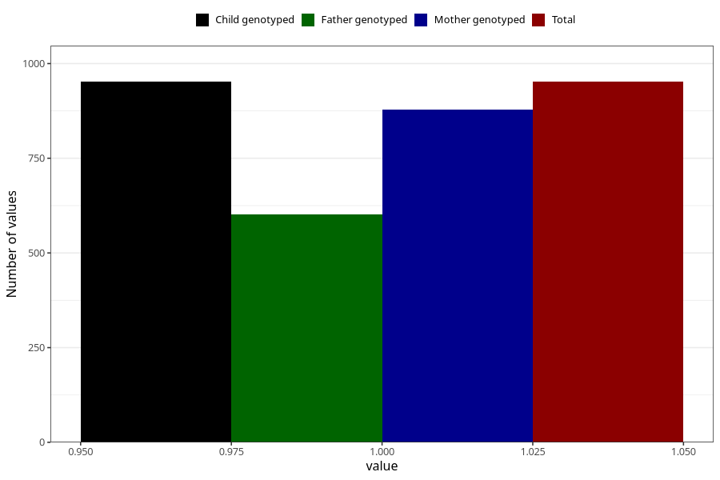

# oedema_9w_12w
Variable mapping to `AA318` in `Skjema1_v12`.
- Number of values:

| Value | Total | Child genotyped | Mother genotyped | Father genotyped |
| ----- | ----- | --------------- | ---------------- | ---------------- |
| Missing | 80071 | 80071 | 75350 | 52709 |
| Non-missing | 952 | 952 | 879 | 602 |
| 1 | 952 | 952 | 879 | 602 |

