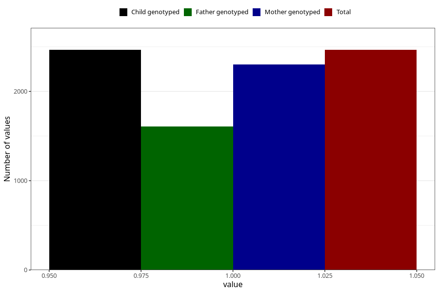

# other_muscle_joint_pain_13w_16w
Variable mapping to `CC364` in `Skjema3_v12`.
- Number of values:

| Value | Total | Child genotyped | Mother genotyped | Father genotyped |
| ----- | ----- | --------------- | ---------------- | ---------------- |
| Missing | 78558 | 78558 | 73925 | 51705 |
| Non-missing | 2465 | 2465 | 2304 | 1606 |
| 1 | 2465 | 2465 | 2304 | 1606 |

