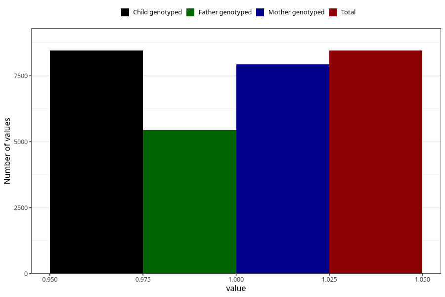

# pelvic_girdle_pain_13w_15w
Variable mapping to `AA179` in `Skjema1_v12`.
- Number of values:

| Value | Total | Child genotyped | Mother genotyped | Father genotyped |
| ----- | ----- | --------------- | ---------------- | ---------------- |
| Missing | 72567 | 72567 | 68287 | 47881 |
| Non-missing | 8456 | 8456 | 7942 | 5430 |
| 1 | 8456 | 8456 | 7942 | 5430 |

