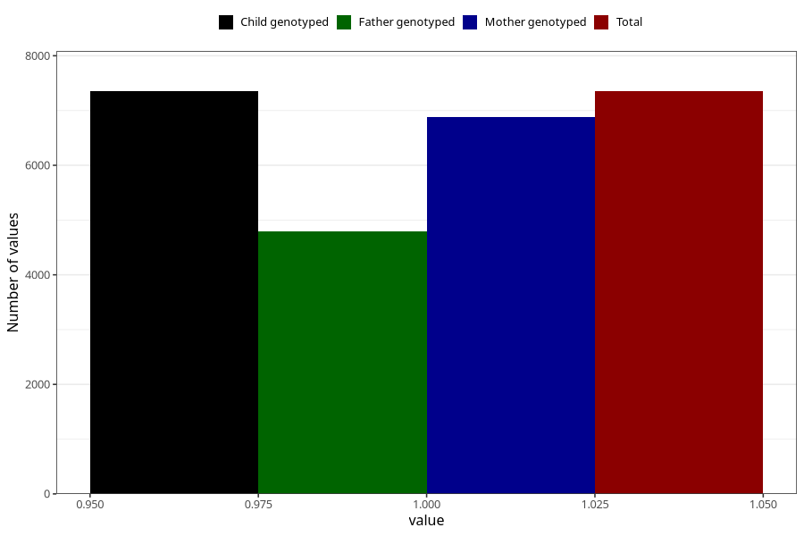

# pelvic_girdle_pain_13w_16w
Variable mapping to `CC340` in `Skjema3_v12`.
- Number of values:

| Value | Total | Child genotyped | Mother genotyped | Father genotyped |
| ----- | ----- | --------------- | ---------------- | ---------------- |
| Missing | 73672 | 73672 | 69355 | 48522 |
| Non-missing | 7351 | 7351 | 6874 | 4789 |
| 1 | 7351 | 7351 | 6874 | 4789 |

