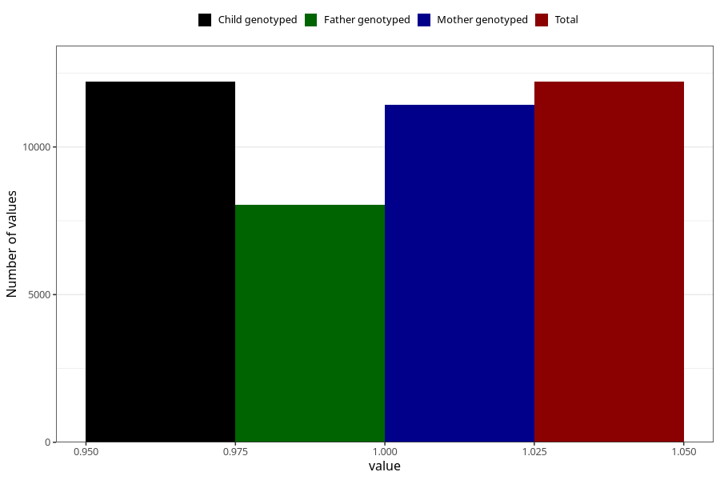

# pelvic_girdle_pain_17w_20w
Variable mapping to `CC341` in `Skjema3_v12`.
- Number of values:

| Value | Total | Child genotyped | Mother genotyped | Father genotyped |
| ----- | ----- | --------------- | ---------------- | ---------------- |
| Missing | 68816 | 68816 | 64806 | 45269 |
| Non-missing | 12207 | 12207 | 11423 | 8042 |
| 1 | 12207 | 12207 | 11423 | 8042 |

