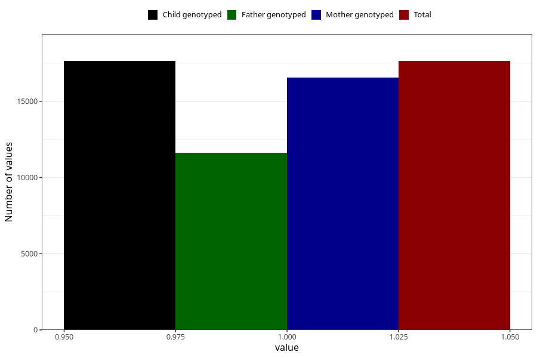

# pelvic_girdle_pain_21w_24w
Variable mapping to `CC342` in `Skjema3_v12`.
- Number of values:

| Value | Total | Child genotyped | Mother genotyped | Father genotyped |
| ----- | ----- | --------------- | ---------------- | ---------------- |
| Missing | 63377 | 63377 | 59670 | 41698 |
| Non-missing | 17646 | 17646 | 16559 | 11613 |
| 1 | 17646 | 17646 | 16559 | 11613 |

