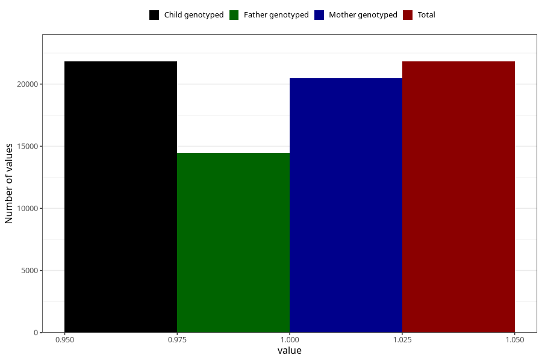

# pelvic_girdle_pain_25w_28w
Variable mapping to `CC343` in `Skjema3_v12`.
- Number of values:

| Value | Total | Child genotyped | Mother genotyped | Father genotyped |
| ----- | ----- | --------------- | ---------------- | ---------------- |
| Missing | 59206 | 59206 | 55758 | 38847 |
| Non-missing | 21817 | 21817 | 20471 | 14464 |
| 1 | 21817 | 21817 | 20471 | 14464 |

