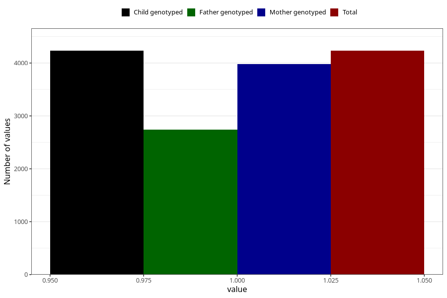

# pelvic_girdle_pain_9w_12w
Variable mapping to `AA178` in `Skjema1_v12`.
- Number of values:

| Value | Total | Child genotyped | Mother genotyped | Father genotyped |
| ----- | ----- | --------------- | ---------------- | ---------------- |
| Missing | 76791 | 76791 | 72248 | 50569 |
| Non-missing | 4232 | 4232 | 3981 | 2742 |
| 1 | 4232 | 4232 | 3981 | 2742 |

