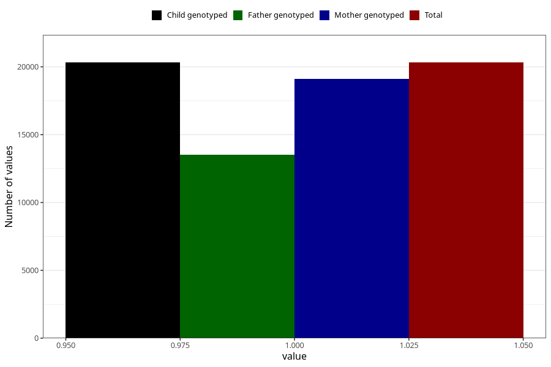

# pelvic_girdle_pain_after_29w
Variable mapping to `CC344` in `Skjema3_v12`.
- Number of values:

| Value | Total | Child genotyped | Mother genotyped | Father genotyped |
| ----- | ----- | --------------- | ---------------- | ---------------- |
| Missing | 60702 | 60702 | 57136 | 39790 |
| Non-missing | 20321 | 20321 | 19093 | 13521 |
| 1 | 20321 | 20321 | 19093 | 13521 |

