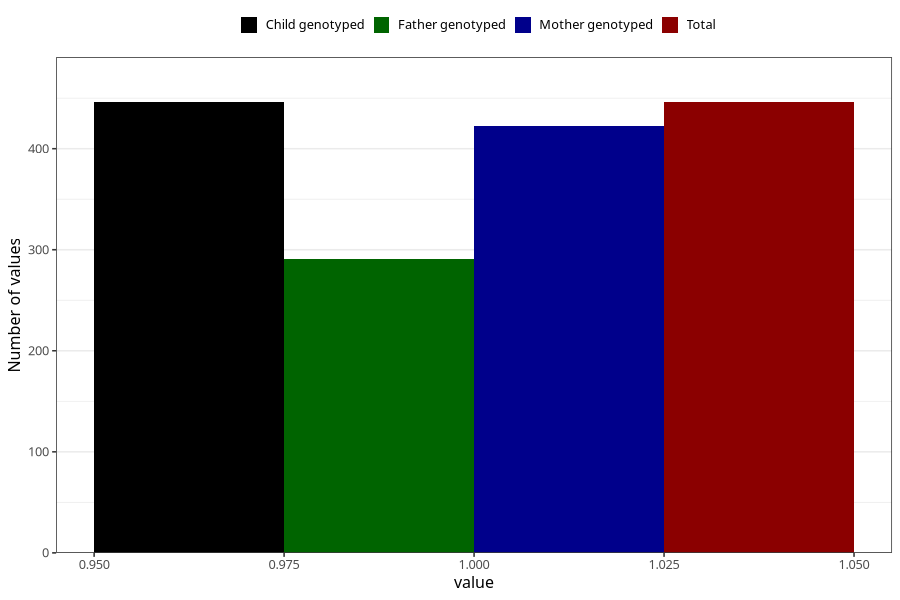

# pneumonia_bronchitis_13w_15w
Variable mapping to `AA389` in `Skjema1_v12`.
- Number of values:

| Value | Total | Child genotyped | Mother genotyped | Father genotyped |
| ----- | ----- | --------------- | ---------------- | ---------------- |
| Missing | 80577 | 80577 | 75807 | 53020 |
| Non-missing | 446 | 446 | 422 | 291 |
| 1 | 446 | 446 | 422 | 291 |

