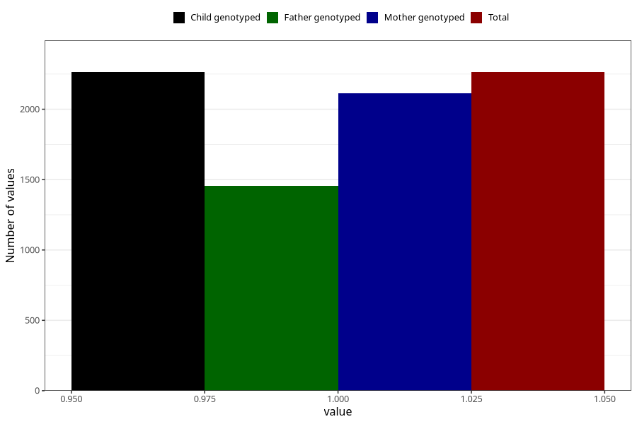

# pregnancy_itch_13w_16w
Variable mapping to `CC424` in `Skjema3_v12`.
- Number of values:

| Value | Total | Child genotyped | Mother genotyped | Father genotyped |
| ----- | ----- | --------------- | ---------------- | ---------------- |
| Missing | 78760 | 78760 | 74116 | 51854 |
| Non-missing | 2263 | 2263 | 2113 | 1457 |
| 1 | 2263 | 2263 | 2113 | 1457 |

