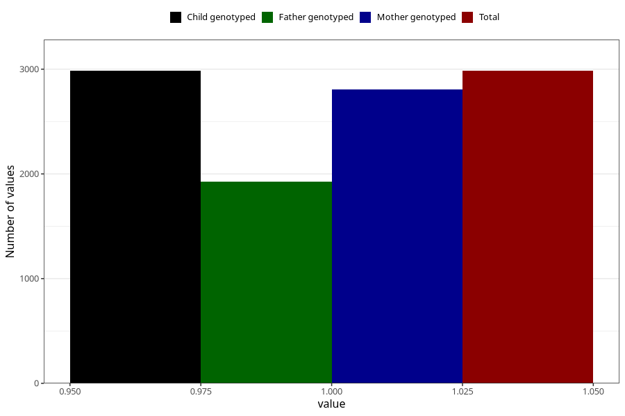

# pregnancy_itch_17w_20w
Variable mapping to `CC425` in `Skjema3_v12`.
- Number of values:

| Value | Total | Child genotyped | Mother genotyped | Father genotyped |
| ----- | ----- | --------------- | ---------------- | ---------------- |
| Missing | 78039 | 78039 | 73420 | 51386 |
| Non-missing | 2984 | 2984 | 2809 | 1925 |
| 1 | 2984 | 2984 | 2809 | 1925 |

