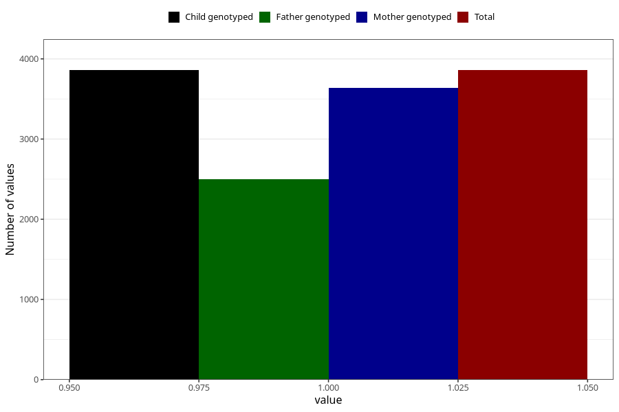

# pregnancy_itch_21w_24w
Variable mapping to `CC426` in `Skjema3_v12`.
- Number of values:

| Value | Total | Child genotyped | Mother genotyped | Father genotyped |
| ----- | ----- | --------------- | ---------------- | ---------------- |
| Missing | 77164 | 77164 | 72591 | 50812 |
| Non-missing | 3859 | 3859 | 3638 | 2499 |
| 1 | 3859 | 3859 | 3638 | 2499 |

