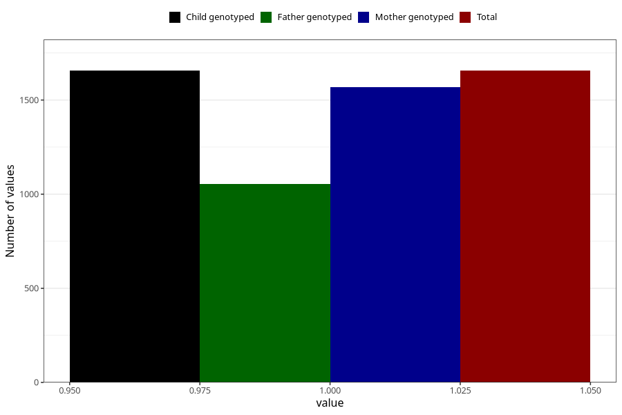

# pregnancy_itch_5w_8w
Variable mapping to `AA257` in `Skjema1_v12`.
- Number of values:

| Value | Total | Child genotyped | Mother genotyped | Father genotyped |
| ----- | ----- | --------------- | ---------------- | ---------------- |
| Missing | 79367 | 79367 | 74659 | 52258 |
| Non-missing | 1656 | 1656 | 1570 | 1053 |
| 1 | 1656 | 1656 | 1570 | 1053 |

