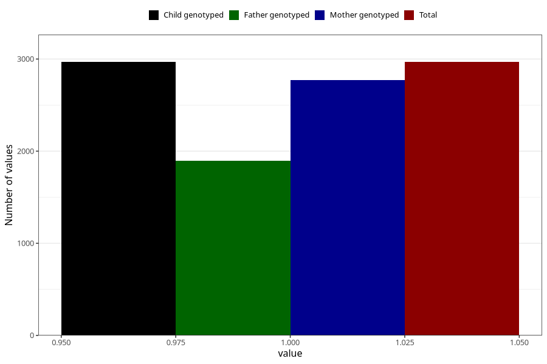

# pregnancy_itch_9w_12w
Variable mapping to `AA258` in `Skjema1_v12`.
- Number of values:

| Value | Total | Child genotyped | Mother genotyped | Father genotyped |
| ----- | ----- | --------------- | ---------------- | ---------------- |
| Missing | 78055 | 78055 | 73454 | 51415 |
| Non-missing | 2968 | 2968 | 2775 | 1896 |
| 1 | 2968 | 2968 | 2775 | 1896 |

