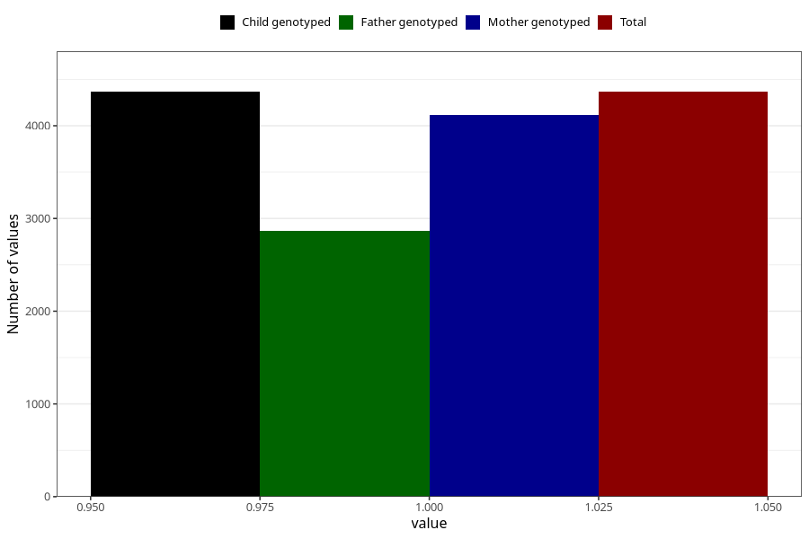

# pregnancy_itch_after_29w
Variable mapping to `CC428` in `Skjema3_v12`.
- Number of values:

| Value | Total | Child genotyped | Mother genotyped | Father genotyped |
| ----- | ----- | --------------- | ---------------- | ---------------- |
| Missing | 76657 | 76657 | 72112 | 50442 |
| Non-missing | 4366 | 4366 | 4117 | 2869 |
| 1 | 4366 | 4366 | 4117 | 2869 |

