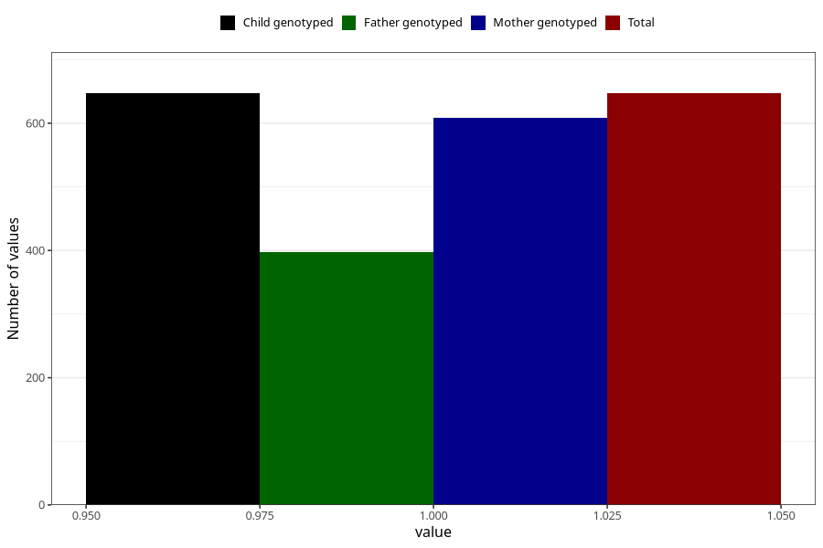

# pregnancy_itch_before_4w
Variable mapping to `AA256` in `Skjema1_v12`.
- Number of values:

| Value | Total | Child genotyped | Mother genotyped | Father genotyped |
| ----- | ----- | --------------- | ---------------- | ---------------- |
| Missing | 80376 | 80376 | 75621 | 52913 |
| Non-missing | 647 | 647 | 608 | 398 |
| 1 | 647 | 647 | 608 | 398 |

