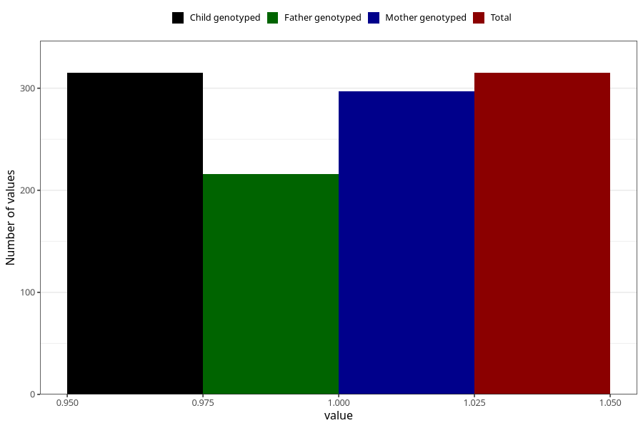

# protein_in_urine_before_4w
Variable mapping to `AA406` in `Skjema1_v12`.
- Number of values:

| Value | Total | Child genotyped | Mother genotyped | Father genotyped |
| ----- | ----- | --------------- | ---------------- | ---------------- |
| Missing | 80708 | 80708 | 75932 | 53095 |
| Non-missing | 315 | 315 | 297 | 216 |
| 1 | 315 | 315 | 297 | 216 |

