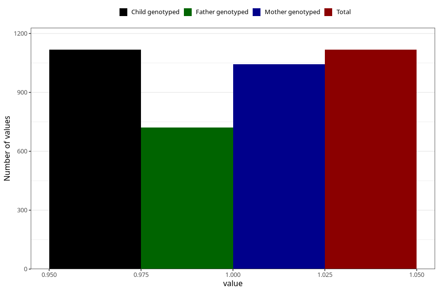

# sinusitis_ear_infection_9w_12w
Variable mapping to `AA368` in `Skjema1_v12`.
- Number of values:

| Value | Total | Child genotyped | Mother genotyped | Father genotyped |
| ----- | ----- | --------------- | ---------------- | ---------------- |
| Missing | 79906 | 79906 | 75186 | 52589 |
| Non-missing | 1117 | 1117 | 1043 | 722 |
| 1 | 1117 | 1117 | 1043 | 722 |

