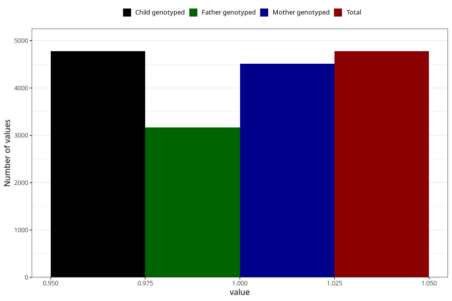

# sleeping_problems_5w_8w
Variable mapping to `AA297` in `Skjema1_v12`.
- Number of values:

| Value | Total | Child genotyped | Mother genotyped | Father genotyped |
| ----- | ----- | --------------- | ---------------- | ---------------- |
| Missing | 76247 | 76247 | 71721 | 50147 |
| Non-missing | 4776 | 4776 | 4508 | 3164 |
| 1 | 4776 | 4776 | 4508 | 3164 |

