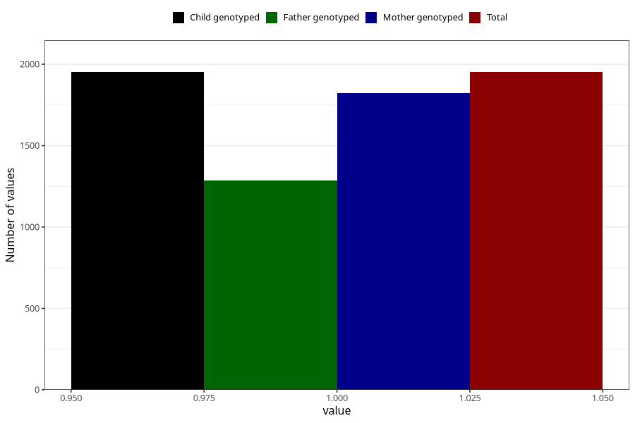

# sleeping_problems_before_4w
Variable mapping to `AA296` in `Skjema1_v12`.
- Number of values:

| Value | Total | Child genotyped | Mother genotyped | Father genotyped |
| ----- | ----- | --------------- | ---------------- | ---------------- |
| Missing | 79071 | 79071 | 74406 | 52027 |
| Non-missing | 1952 | 1952 | 1823 | 1284 |
| 1 | 1952 | 1952 | 1823 | 1284 |

