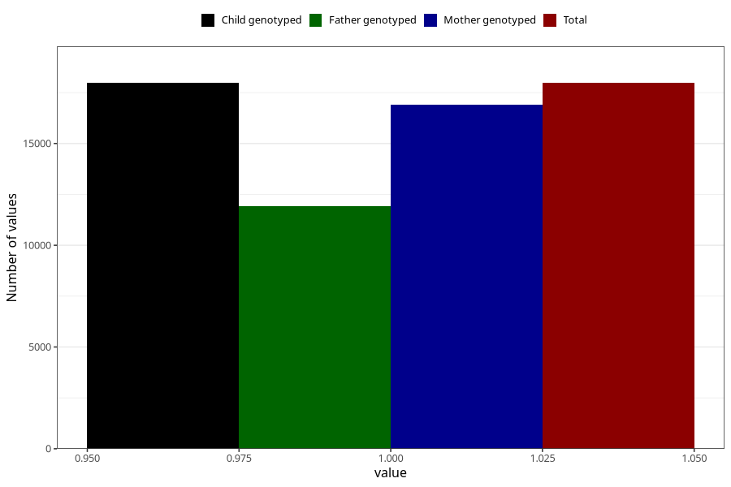

# unusual_tiredness_before_4w
Variable mapping to `AA286` in `Skjema1_v12`.
- Number of values:

| Value | Total | Child genotyped | Mother genotyped | Father genotyped |
| ----- | ----- | --------------- | ---------------- | ---------------- |
| Missing | 63048 | 63048 | 59320 | 41374 |
| Non-missing | 17975 | 17975 | 16909 | 11937 |
| 1 | 17975 | 17975 | 16909 | 11937 |

