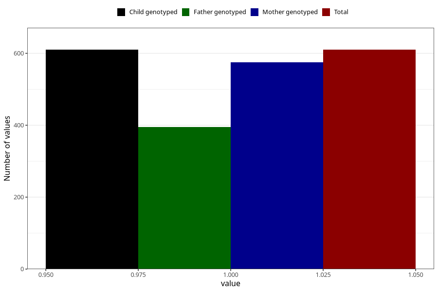

# vaginal_bleeding_1_after_29w
Variable mapping to `CC321` in `Skjema3_v12`.
- Number of values:

| Value | Total | Child genotyped | Mother genotyped | Father genotyped |
| ----- | ----- | --------------- | ---------------- | ---------------- |
| Missing | 80413 | 80413 | 75654 | 52916 |
| Non-missing | 610 | 610 | 575 | 395 |
| 1 | 610 | 610 | 575 | 395 |

