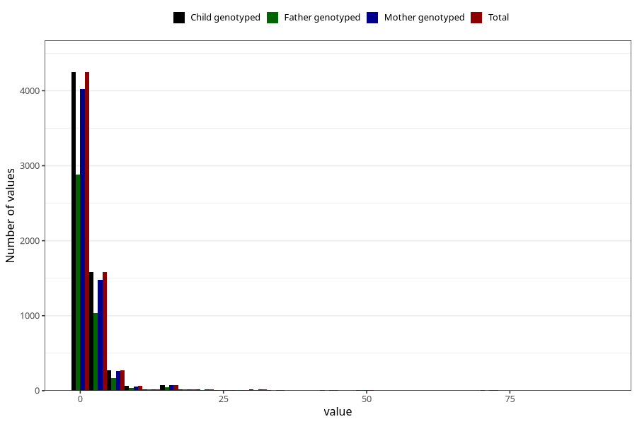

# vaginal_bleeding_1_duration
Variable mapping to `CC322` in `Skjema3_v12`.
- Number of values:

| Value | Total | Child genotyped | Mother genotyped | Father genotyped |
| ----- | ----- | --------------- | ---------------- | ---------------- |
| Missing | 74656 | 74656 | 70213 | 49056 |
| Non-missing | 6367 | 6367 | 6016 | 4255 |
| 25th percentile | 1 | 1 | 1 | 1 |
| 50th percentile | 1 | 1 | 1 | 1 |
| 75th percentile | 2 | 2 | 2 | 2 |
| Mean | 2.40128789068635 | 2.40128789068635 | 2.39926861702128 | 2.26509988249119 |
| Standard deviation | 5.19378948106534 | 5.19378948106534 | 5.20708253493947 | 4.73672066362048 |
| N | 6367 | 6367 | 6016 | 4255 |

