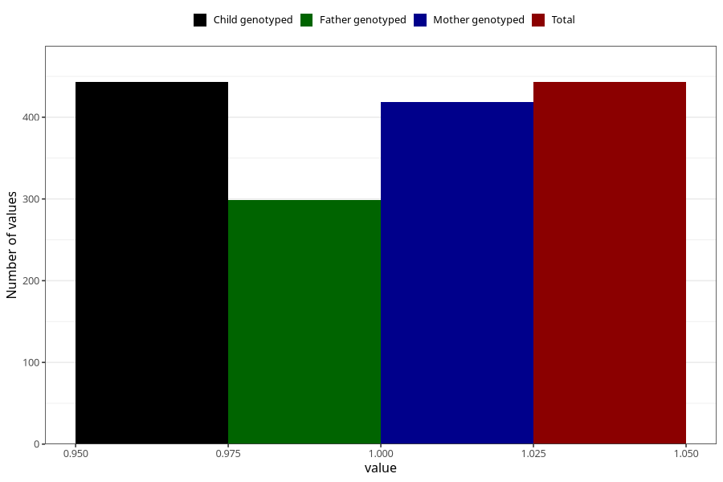

# vaginal_bleeding_2_21w_24w
Variable mapping to `CC326` in `Skjema3_v12`.
- Number of values:

| Value | Total | Child genotyped | Mother genotyped | Father genotyped |
| ----- | ----- | --------------- | ---------------- | ---------------- |
| Missing | 80580 | 80580 | 75810 | 53012 |
| Non-missing | 443 | 443 | 419 | 299 |
| 1 | 443 | 443 | 419 | 299 |

