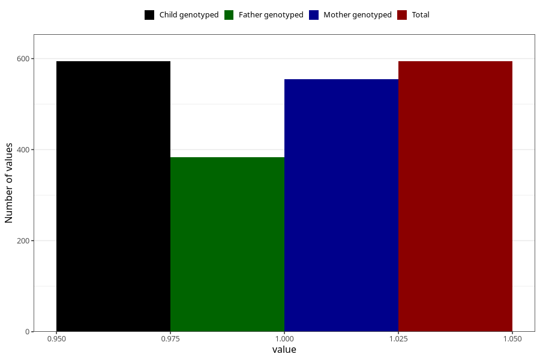

# vaginal_bleeding_2_25w_28w
Variable mapping to `CC327` in `Skjema3_v12`.
- Number of values:

| Value | Total | Child genotyped | Mother genotyped | Father genotyped |
| ----- | ----- | --------------- | ---------------- | ---------------- |
| Missing | 80429 | 80429 | 75674 | 52927 |
| Non-missing | 594 | 594 | 555 | 384 |
| 1 | 594 | 594 | 555 | 384 |

