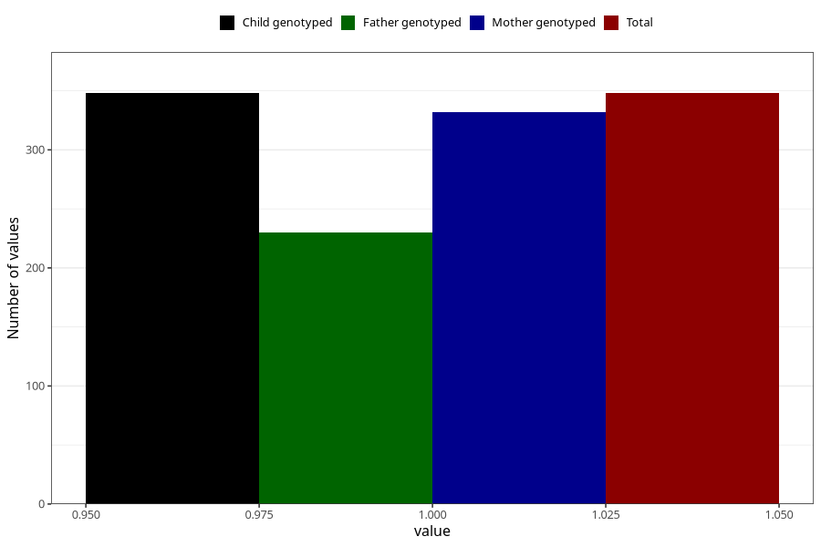

# vaginal_bleeding_2_after_29w
Variable mapping to `CC328` in `Skjema3_v12`.
- Number of values:

| Value | Total | Child genotyped | Mother genotyped | Father genotyped |
| ----- | ----- | --------------- | ---------------- | ---------------- |
| Missing | 80675 | 80675 | 75897 | 53081 |
| Non-missing | 348 | 348 | 332 | 230 |
| 1 | 348 | 348 | 332 | 230 |

