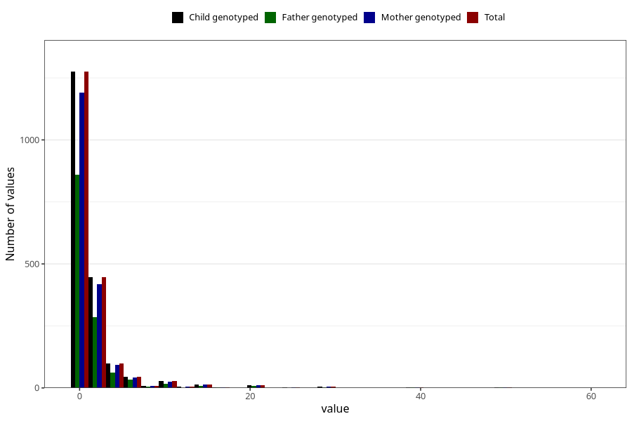

# vaginal_bleeding_2_duration
Variable mapping to `CC329` in `Skjema3_v12`.
- Number of values:

| Value | Total | Child genotyped | Mother genotyped | Father genotyped |
| ----- | ----- | --------------- | ---------------- | ---------------- |
| Missing | 79072 | 79072 | 74402 | 52018 |
| Non-missing | 1951 | 1951 | 1827 | 1293 |
| 25th percentile | 1 | 1 | 1 | 1 |
| 50th percentile | 1 | 1 | 1 | 1 |
| 75th percentile | 2 | 2 | 2 | 2 |
| Mean | 2.30138390568939 | 2.30138390568939 | 2.33059660645868 | 2.22505800464037 |
| Standard deviation | 4.20114674598005 | 4.20114674598005 | 4.3031560573031 | 3.94402672944899 |
| N | 1951 | 1951 | 1827 | 1293 |

