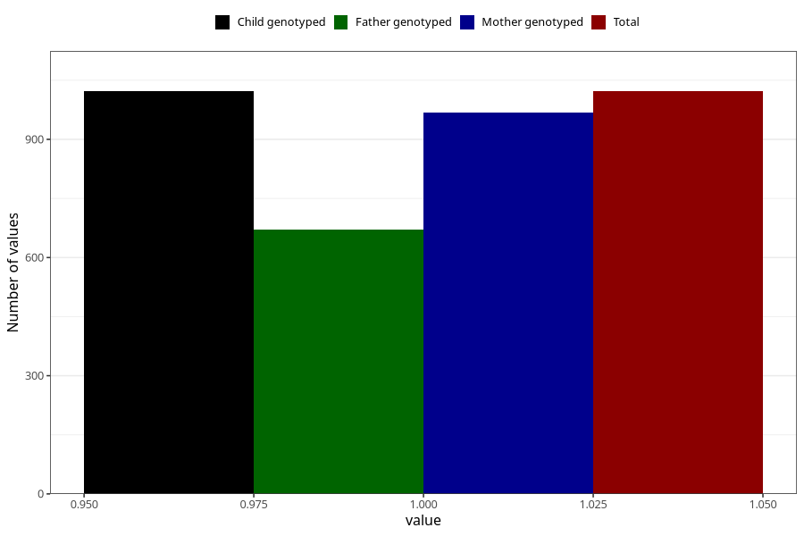

# vaginal_bleeding_know_why_other
Variable mapping to `CC338` in `Skjema3_v12`.
- Number of values:

| Value | Total | Child genotyped | Mother genotyped | Father genotyped |
| ----- | ----- | --------------- | ---------------- | ---------------- |
| Missing | 80001 | 80001 | 75261 | 52641 |
| Non-missing | 1022 | 1022 | 968 | 670 |
| 1 | 1022 | 1022 | 968 | 670 |

