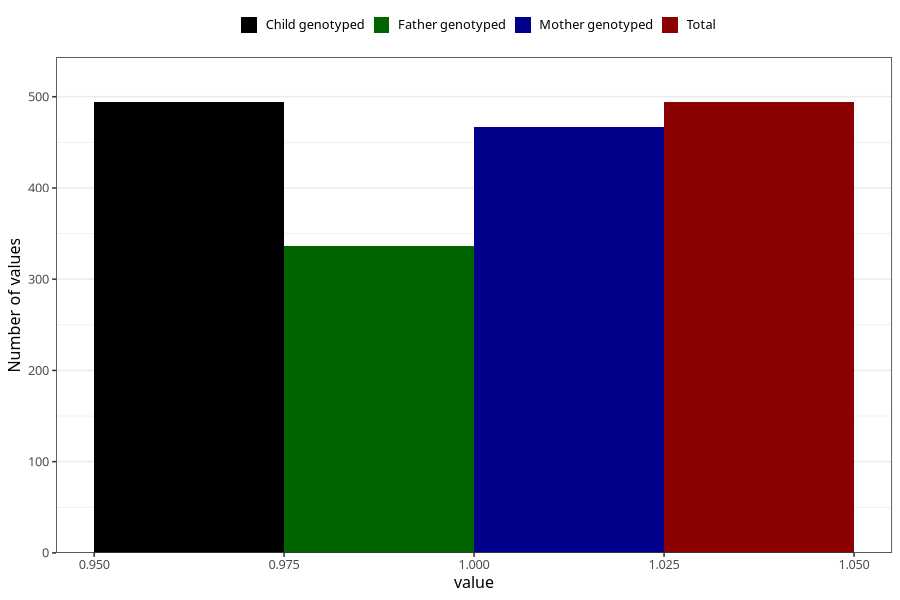

# vaginal_bleeding_more_than_two_episodes
Variable mapping to `CC330` in `Skjema3_v12`.
- Number of values:

| Value | Total | Child genotyped | Mother genotyped | Father genotyped |
| ----- | ----- | --------------- | ---------------- | ---------------- |
| Missing | 80529 | 80529 | 75762 | 52975 |
| Non-missing | 494 | 494 | 467 | 336 |
| 1 | 494 | 494 | 467 | 336 |

