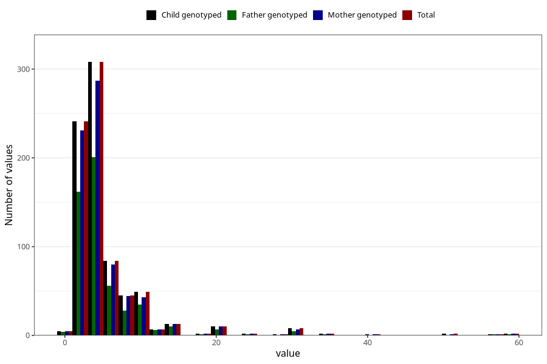

# vaginal_bleeding_more_than_two_episodes_n
Variable mapping to `CC331` in `Skjema3_v12`.
- Number of values:

| Value | Total | Child genotyped | Mother genotyped | Father genotyped |
| ----- | ----- | --------------- | ---------------- | ---------------- |
| Missing | 80240 | 80240 | 75490 | 52792 |
| Non-missing | 783 | 783 | 739 | 519 |
| 25th percentile | 3 | 3 | 3 | 3 |
| 50th percentile | 4 | 4 | 4 | 4 |
| 75th percentile | 6 | 6 | 6 | 6 |
| Mean | 5.96679438058748 | 5.96679438058748 | 5.92016238159675 | 5.78420038535645 |
| Standard deviation | 6.0595021291831 | 6.0595021291831 | 5.92823952129424 | 5.37436903779065 |
| N | 783 | 783 | 739 | 519 |

