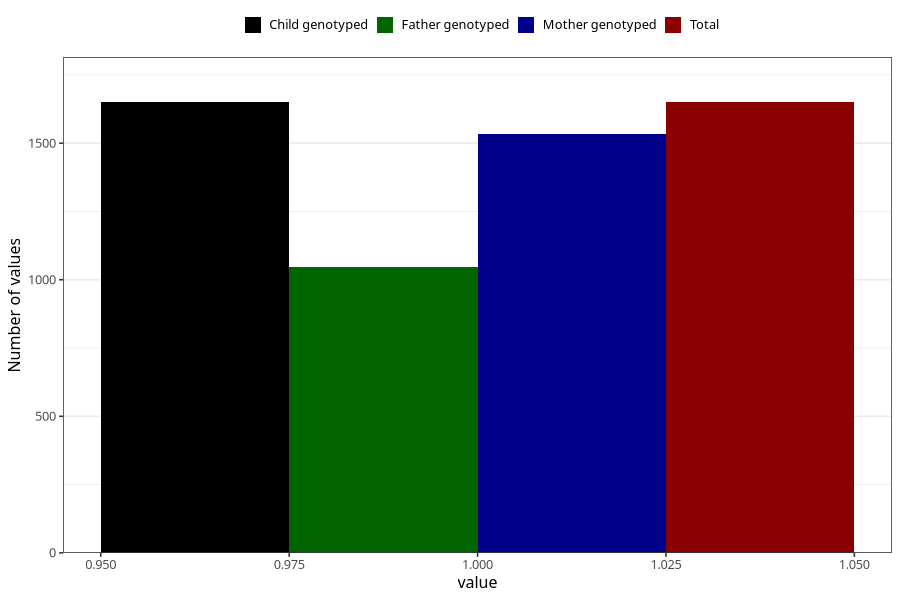

# vaginal_catarrh_unusual_discharge_5w_8w
Variable mapping to `AA247` in `Skjema1_v12`.
- Number of values:

| Value | Total | Child genotyped | Mother genotyped | Father genotyped |
| ----- | ----- | --------------- | ---------------- | ---------------- |
| Missing | 79373 | 79373 | 74694 | 52265 |
| Non-missing | 1650 | 1650 | 1535 | 1046 |
| 1 | 1650 | 1650 | 1535 | 1046 |

