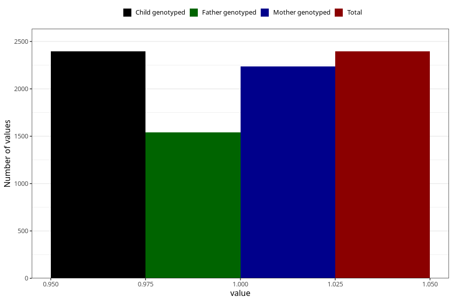

# vaginal_catarrh_unusual_discharge_9w_12w
Variable mapping to `AA248` in `Skjema1_v12`.
- Number of values:

| Value | Total | Child genotyped | Mother genotyped | Father genotyped |
| ----- | ----- | --------------- | ---------------- | ---------------- |
| Missing | 78628 | 78628 | 73990 | 51768 |
| Non-missing | 2395 | 2395 | 2239 | 1543 |
| 1 | 2395 | 2395 | 2239 | 1543 |

