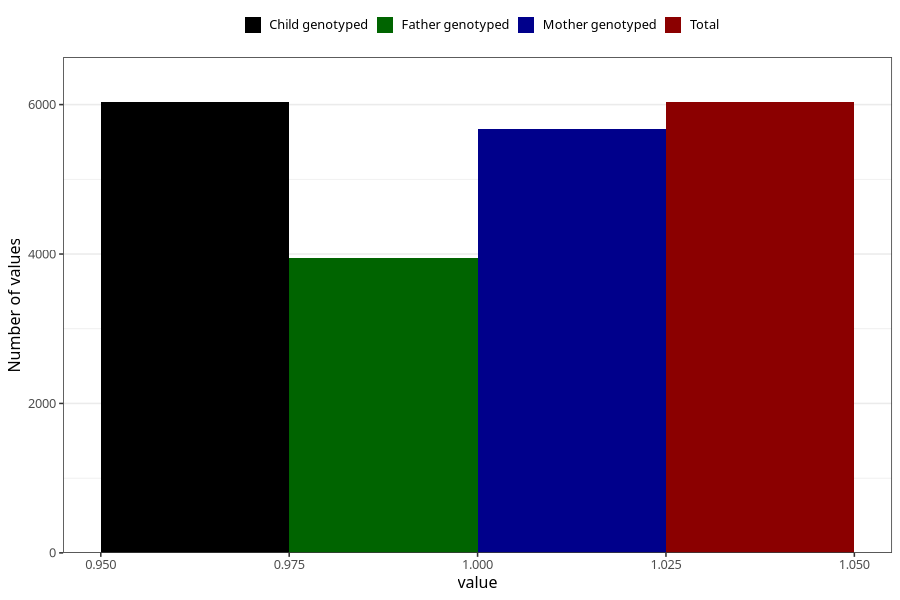

# vaginal_thrush_13w_15w
Variable mapping to `AA239` in `Skjema1_v12`.
- Number of values:

| Value | Total | Child genotyped | Mother genotyped | Father genotyped |
| ----- | ----- | --------------- | ---------------- | ---------------- |
| Missing | 74991 | 74991 | 70551 | 49359 |
| Non-missing | 6032 | 6032 | 5678 | 3952 |
| 1 | 6032 | 6032 | 5678 | 3952 |

