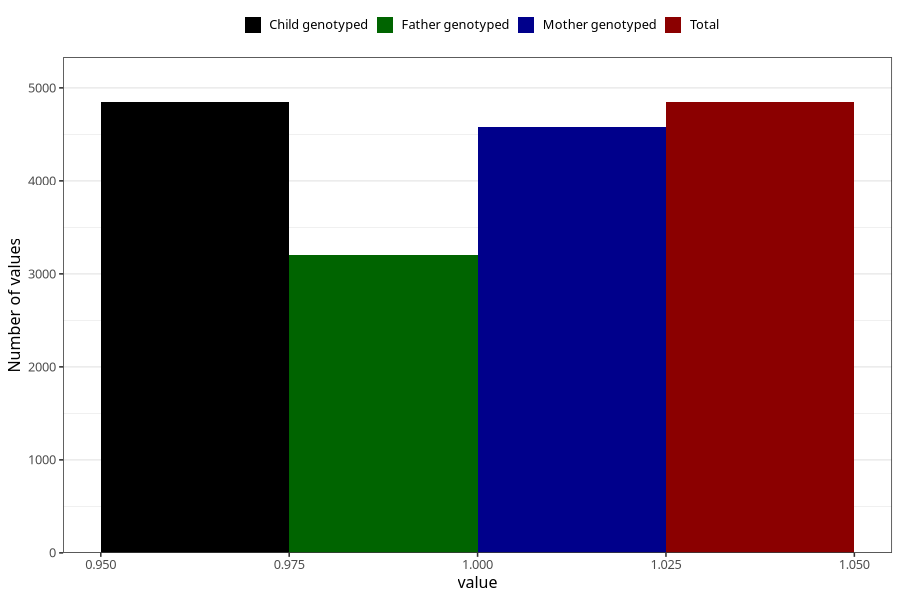

# vaginal_thrush_13w_16w
Variable mapping to `CC400` in `Skjema3_v12`.
- Number of values:

| Value | Total | Child genotyped | Mother genotyped | Father genotyped |
| ----- | ----- | --------------- | ---------------- | ---------------- |
| Missing | 76177 | 76177 | 71652 | 50110 |
| Non-missing | 4846 | 4846 | 4577 | 3201 |
| 1 | 4846 | 4846 | 4577 | 3201 |

