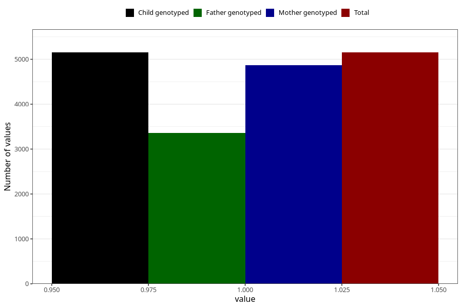

# vaginal_thrush_17w_20w
Variable mapping to `CC401` in `Skjema3_v12`.
- Number of values:

| Value | Total | Child genotyped | Mother genotyped | Father genotyped |
| ----- | ----- | --------------- | ---------------- | ---------------- |
| Missing | 75871 | 75871 | 71364 | 49946 |
| Non-missing | 5152 | 5152 | 4865 | 3365 |
| 1 | 5152 | 5152 | 4865 | 3365 |

