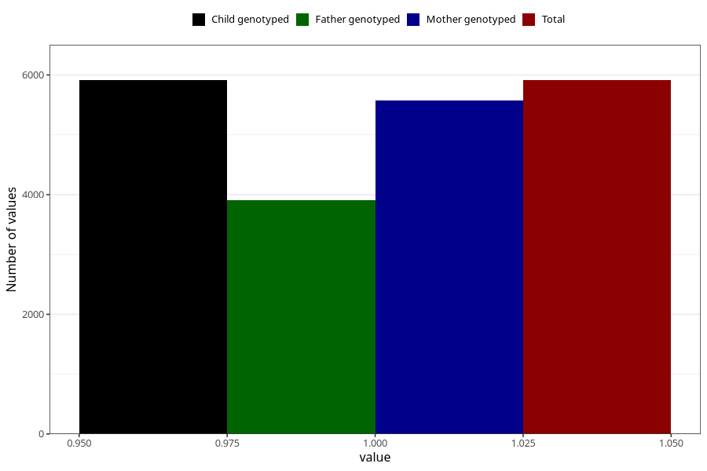

# vaginal_thrush_21w_24w
Variable mapping to `CC402` in `Skjema3_v12`.
- Number of values:

| Value | Total | Child genotyped | Mother genotyped | Father genotyped |
| ----- | ----- | --------------- | ---------------- | ---------------- |
| Missing | 75111 | 75111 | 70657 | 49407 |
| Non-missing | 5912 | 5912 | 5572 | 3904 |
| 1 | 5912 | 5912 | 5572 | 3904 |

