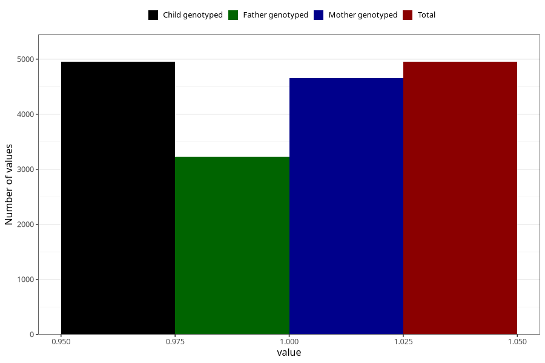

# vaginal_thrush_5w_8w
Variable mapping to `AA237` in `Skjema1_v12`.
- Number of values:

| Value | Total | Child genotyped | Mother genotyped | Father genotyped |
| ----- | ----- | --------------- | ---------------- | ---------------- |
| Missing | 76072 | 76072 | 71573 | 50080 |
| Non-missing | 4951 | 4951 | 4656 | 3231 |
| 1 | 4951 | 4951 | 4656 | 3231 |

