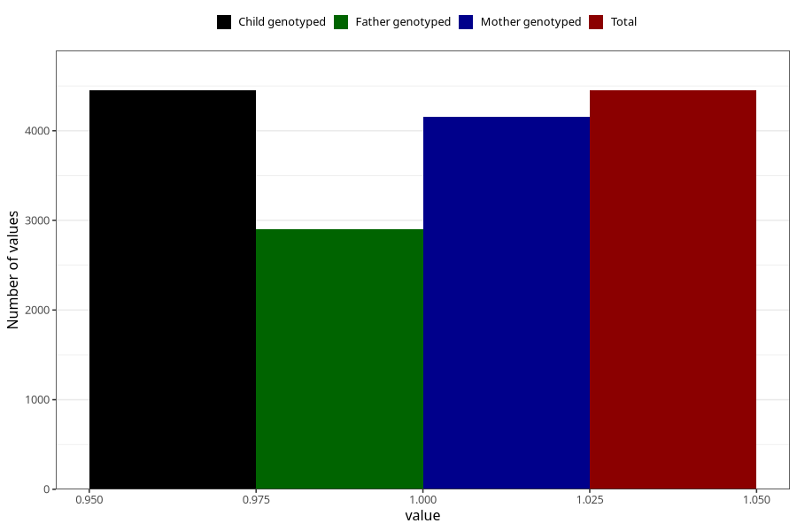

# vaginal_thrush_after_29w
Variable mapping to `CC404` in `Skjema3_v12`.
- Number of values:

| Value | Total | Child genotyped | Mother genotyped | Father genotyped |
| ----- | ----- | --------------- | ---------------- | ---------------- |
| Missing | 76573 | 76573 | 72078 | 50407 |
| Non-missing | 4450 | 4450 | 4151 | 2904 |
| 1 | 4450 | 4450 | 4151 | 2904 |

