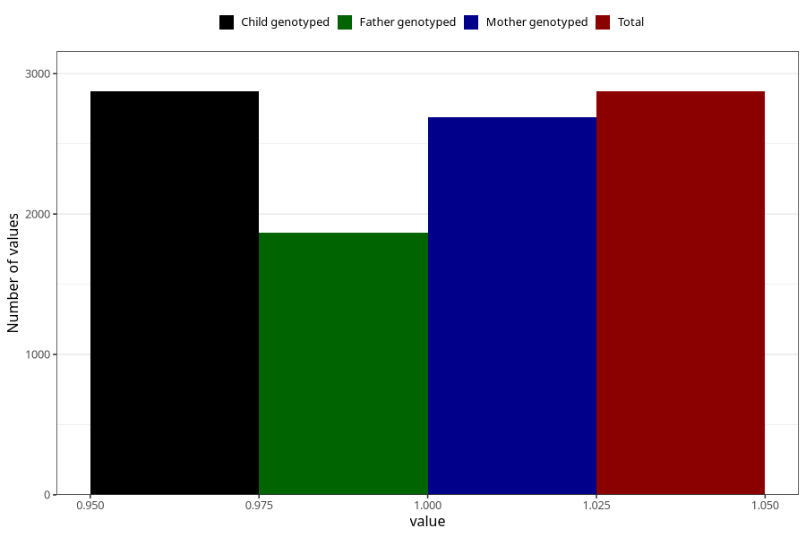

# vaginal_thrush_before_4w
Variable mapping to `AA236` in `Skjema1_v12`.
- Number of values:

| Value | Total | Child genotyped | Mother genotyped | Father genotyped |
| ----- | ----- | --------------- | ---------------- | ---------------- |
| Missing | 78150 | 78150 | 73537 | 51445 |
| Non-missing | 2873 | 2873 | 2692 | 1866 |
| 1 | 2873 | 2873 | 2692 | 1866 |

