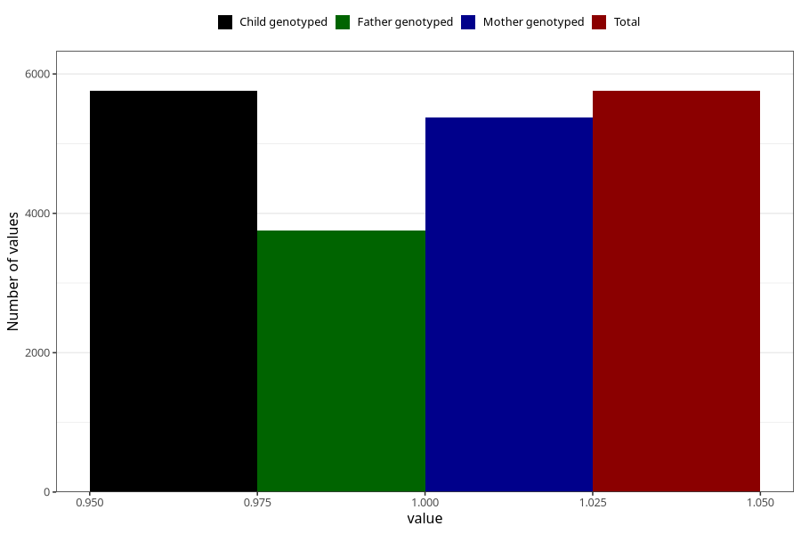

# vomiting_before_4w
Variable mapping to `AA226` in `Skjema1_v12`.
- Number of values:

| Value | Total | Child genotyped | Mother genotyped | Father genotyped |
| ----- | ----- | --------------- | ---------------- | ---------------- |
| Missing | 75267 | 75267 | 70848 | 49564 |
| Non-missing | 5756 | 5756 | 5381 | 3747 |
| 1 | 5756 | 5756 | 5381 | 3747 |

