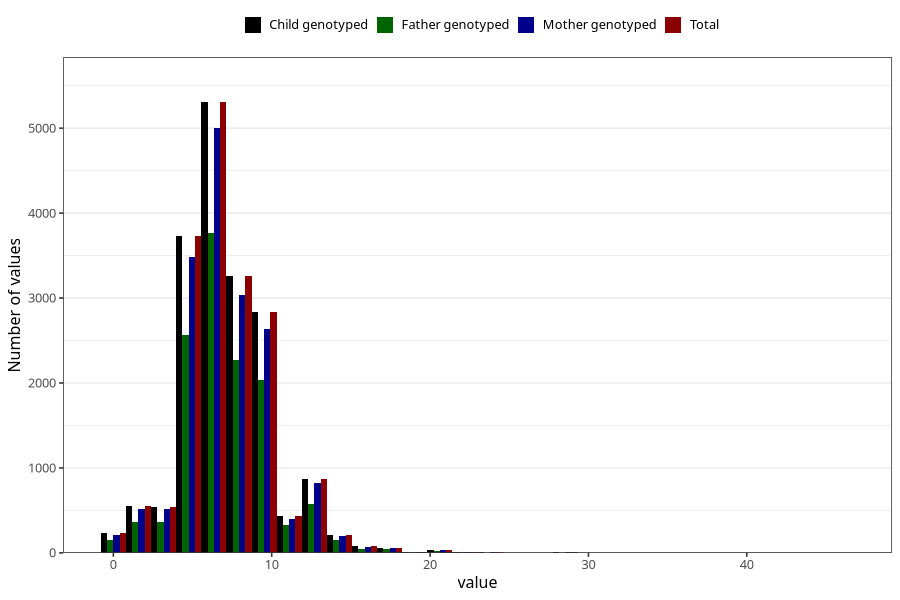

# vomiting_week_from_q2
Variable mapping to `BB857` in `Skjema2CDW_v12`.
- Number of values:

| Value | Total | Child genotyped | Mother genotyped | Father genotyped |
| ----- | ----- | --------------- | ---------------- | ---------------- |
| Missing | 62812 | 62812 | 59188 | 40589 |
| Non-missing | 18211 | 18211 | 17041 | 12722 |
| 25th percentile | 5 | 5 | 5 | 5 |
| 50th percentile | 7 | 7 | 7 | 7 |
| 75th percentile | 9 | 9 | 9 | 9 |
| Mean | 7.09719400362418 | 7.09719400362418 | 7.09817498973065 | 7.13150448042761 |
| Standard deviation | 3.04070830693853 | 3.04070830693853 | 3.0393618179959 | 2.98476324862814 |
| N | 18211 | 18211 | 17041 | 12722 |

