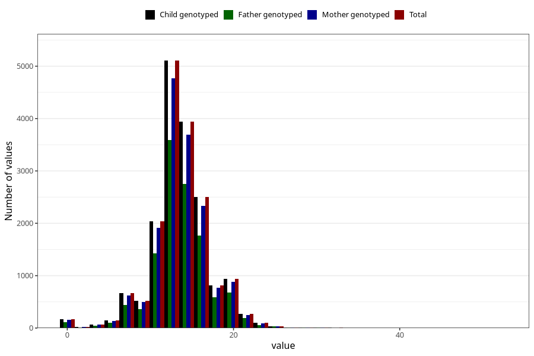

# vomiting_week_to_q2
Variable mapping to `BB858` in `Skjema2CDW_v12`.
- Number of values:

| Value | Total | Child genotyped | Mother genotyped | Father genotyped |
| ----- | ----- | --------------- | ---------------- | ---------------- |
| Missing | 63656 | 63656 | 59973 | 41144 |
| Non-missing | 17367 | 17367 | 16256 | 12167 |
| 25th percentile | 12 | 12 | 12 | 12 |
| 50th percentile | 13 | 13 | 13 | 13 |
| 75th percentile | 16 | 16 | 16 | 16 |
| Mean | 13.6020613807796 | 13.6020613807796 | 13.6023622047244 | 13.6378729349881 |
| Standard deviation | 3.64341776962603 | 3.64341776962603 | 3.64706975067768 | 3.60922508081736 |
| N | 17367 | 17367 | 16256 | 12167 |

