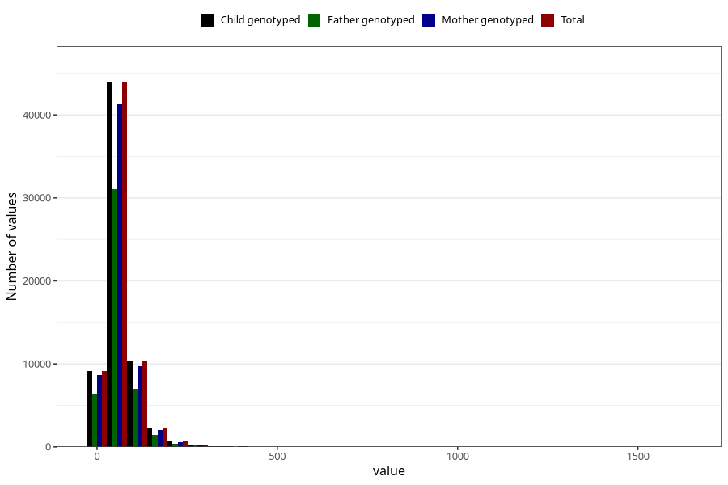

# added_sugar
Variable mapping to `SUKKER` in `Skjema2_beregning_CDW_v12`.
- Number of values:

| Value | Total | Child genotyped | Mother genotyped | Father genotyped |
| ----- | ----- | --------------- | ---------------- | ---------------- |
| Missing | 14322 | 14322 | 13583 | 6707 |
| Non-missing | 66701 | 66701 | 62646 | 46604 |
| 25th percentile | 36.16 | 36.16 | 36.11 | 35.97 |
| 50th percentile | 52.92 | 52.92 | 52.84 | 52.37 |
| 75th percentile | 76.84 | 76.84 | 76.74 | 75.66 |
| Mean | 63.041944648506 | 63.041944648506 | 62.9034128276346 | 61.906857780448 |
| Standard deviation | 45.4103297156655 | 45.4103297156655 | 45.3119933322867 | 43.3173570761649 |
| N | 66701 | 66701 | 62646 | 46604 |

