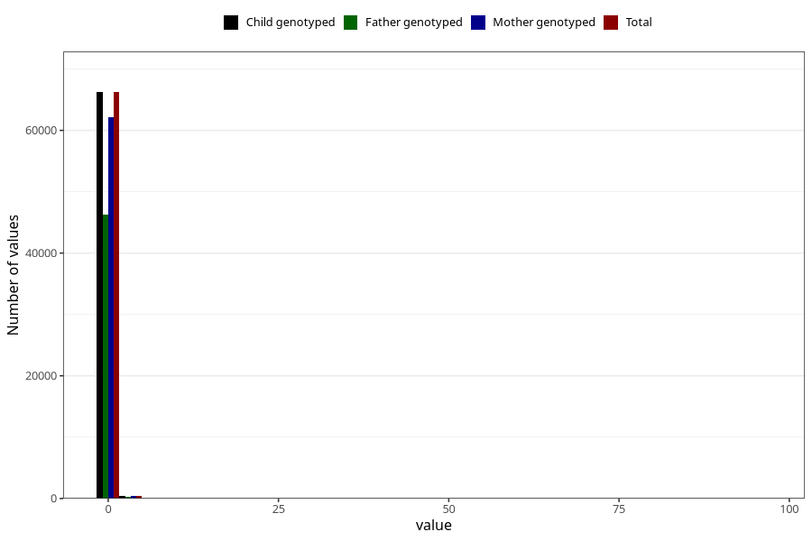

# alcohol
Variable mapping to `ALKOHOL` in `Skjema2_beregning_CDW_v12`.
- Number of values:

| Value | Total | Child genotyped | Mother genotyped | Father genotyped |
| ----- | ----- | --------------- | ---------------- | ---------------- |
| Missing | 14322 | 14322 | 13583 | 6707 |
| Non-missing | 66701 | 66701 | 62646 | 46604 |
| 25th percentile | 0 | 0 | 0 | 0 |
| 50th percentile | 0 | 0 | 0 | 0 |
| 75th percentile | 0 | 0 | 0 | 0 |
| Mean | 0.0773435180881846 | 0.0773435180881846 | 0.0772944800944993 | 0.0713569650673762 |
| Standard deviation | 0.628194120509759 | 0.628194120509759 | 0.639273379088672 | 0.435599821860658 |
| N | 66701 | 66701 | 62646 | 46604 |

