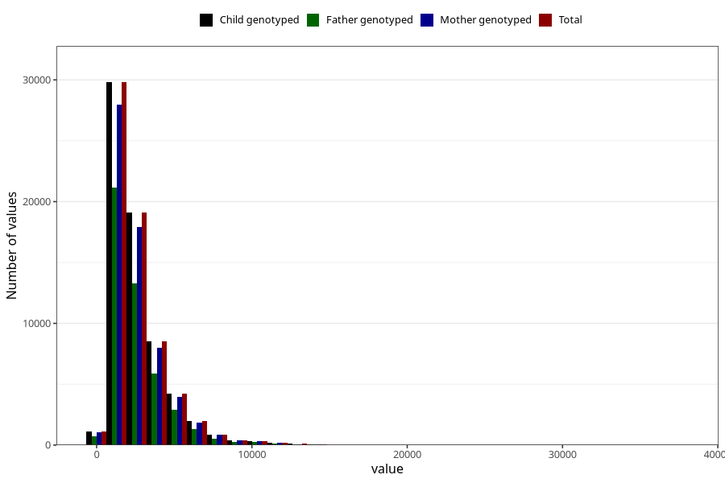

# beta_carotene
Variable mapping to `BETAKAROTEN` in `Skjema2_beregning_CDW_v12`.
- Number of values:

| Value | Total | Child genotyped | Mother genotyped | Father genotyped |
| ----- | ----- | --------------- | ---------------- | ---------------- |
| Missing | 14322 | 14322 | 13583 | 6707 |
| Non-missing | 66701 | 66701 | 62646 | 46604 |
| 25th percentile | 1452.77 | 1452.77 | 1452.87 | 1445.675 |
| 50th percentile | 2041.5 | 2041.5 | 2041.395 | 2023.985 |
| 75th percentile | 3233.62 | 3233.62 | 3233.7625 | 3202.51 |
| Mean | 2625.80152831292 | 2625.80152831292 | 2626.22173562558 | 2596.70253969616 |
| Standard deviation | 1868.07819574754 | 1868.07819574754 | 1866.2268800898 | 1840.0171097225 |
| N | 66701 | 66701 | 62646 | 46604 |

