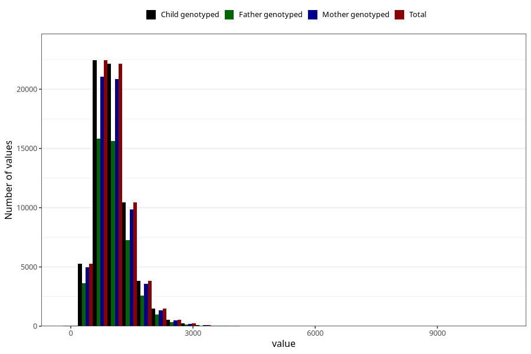

# calsium
Variable mapping to `KALSIUM` in `Skjema2_beregning_CDW_v12`.
- Number of values:

| Value | Total | Child genotyped | Mother genotyped | Father genotyped |
| ----- | ----- | --------------- | ---------------- | ---------------- |
| Missing | 14322 | 14322 | 13583 | 6707 |
| Non-missing | 66701 | 66701 | 62646 | 46604 |
| 25th percentile | 750.63 | 750.63 | 749.9925 | 749.525 |
| 50th percentile | 976.37 | 976.37 | 976.32 | 973.655 |
| 75th percentile | 1265.7 | 1265.7 | 1264.47 | 1258.3975 |
| Mean | 1056.30963343878 | 1056.30963343878 | 1055.04165692941 | 1049.66157776157 |
| Standard deviation | 474.494608653006 | 474.494608653006 | 473.141056011939 | 463.406930853888 |
| N | 66701 | 66701 | 62646 | 46604 |

