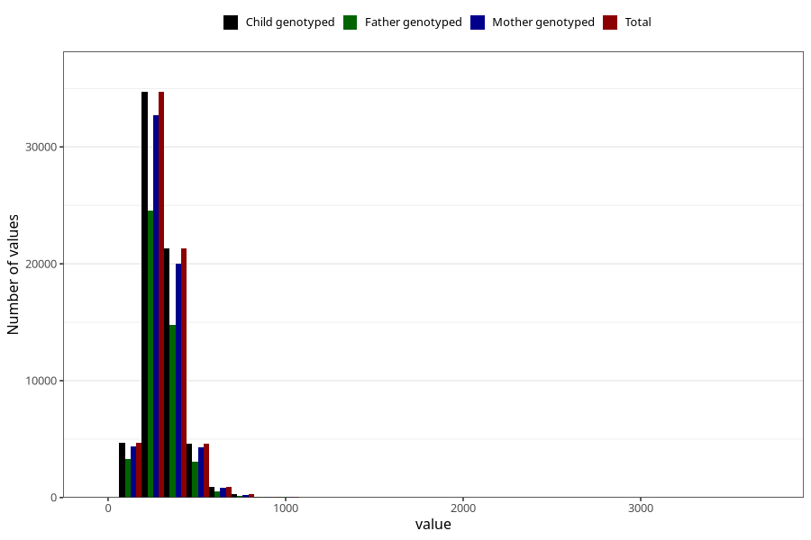

# carbohydrates
Variable mapping to `TOT_KARB` in `Skjema2_beregning_CDW_v12`.
- Number of values:

| Value | Total | Child genotyped | Mother genotyped | Father genotyped |
| ----- | ----- | --------------- | ---------------- | ---------------- |
| Missing | 14322 | 14322 | 13583 | 6707 |
| Non-missing | 66701 | 66701 | 62646 | 46604 |
| 25th percentile | 243.6 | 243.6 | 243.435 | 242.5 |
| 50th percentile | 295.87 | 295.87 | 295.695 | 294.295 |
| 75th percentile | 359.05 | 359.05 | 358.765 | 355.865 |
| Mean | 311.427628671234 | 311.427628671234 | 311.135164575552 | 308.653411080594 |
| Standard deviation | 108.949458196664 | 108.949458196664 | 108.440791226445 | 104.652015875193 |
| N | 66701 | 66701 | 62646 | 46604 |

