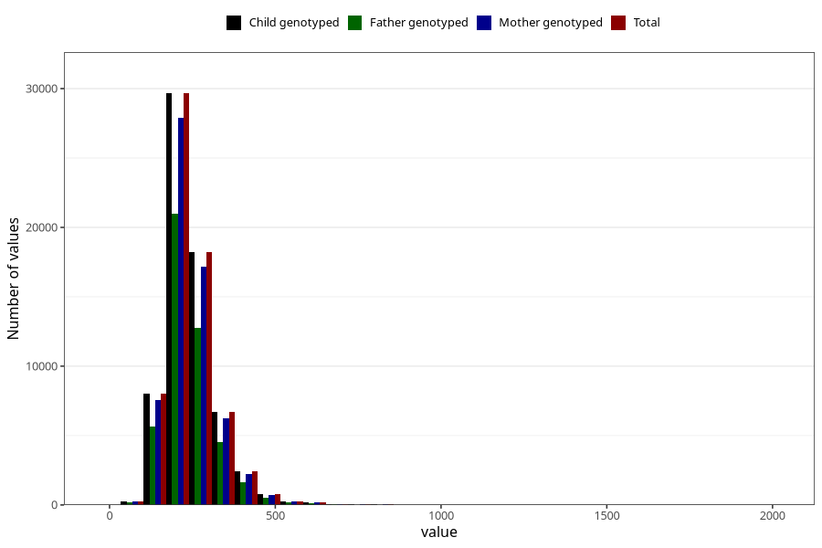

# cholesterol_mg
Variable mapping to `KOLESTEROL` in `Skjema2_beregning_CDW_v12`.
- Number of values:

| Value | Total | Child genotyped | Mother genotyped | Father genotyped |
| ----- | ----- | --------------- | ---------------- | ---------------- |
| Missing | 14322 | 14322 | 13583 | 6707 |
| Non-missing | 66701 | 66701 | 62646 | 46604 |
| 25th percentile | 192.67 | 192.67 | 192.56 | 192.2 |
| 50th percentile | 228.88 | 228.88 | 228.83 | 227.82 |
| 75th percentile | 278.79 | 278.79 | 278.49 | 276.9 |
| Mean | 244.273755715806 | 244.273755715806 | 244.108694090604 | 242.596547721226 |
| Standard deviation | 80.6537353063911 | 80.6537353063911 | 80.4241531890631 | 78.3573145699234 |
| N | 66701 | 66701 | 62646 | 46604 |

