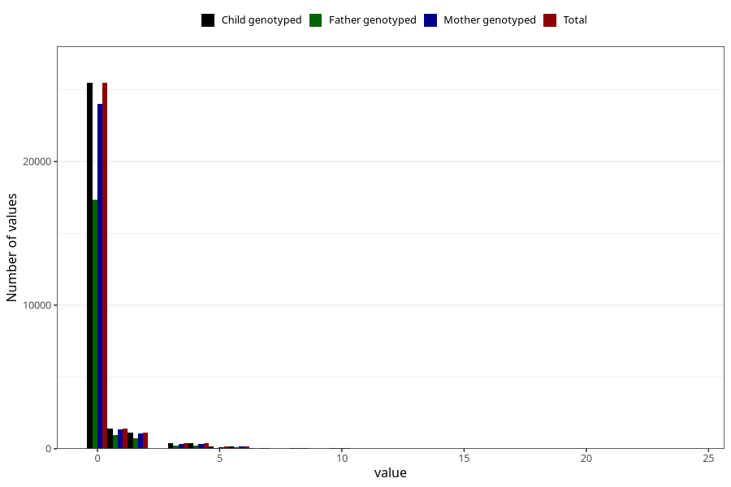

# coffee_before_boiled
Variable mapping to `AA1383` in `Skjema1_v12`.
- Number of values:

| Value | Total | Child genotyped | Mother genotyped | Father genotyped |
| ----- | ----- | --------------- | ---------------- | ---------------- |
| Missing | 51824 | 51824 | 48704 | 33551 |
| Non-missing | 29199 | 29199 | 27525 | 19760 |
| Consumption have been reported by a mark but no amount given | 1 | 1 | 1 |0 |
| 0 | 25474 | 25474 | 24030 | 17345 |
| 1 | 1417 | 1417 | 1335 | 932 |
| 2 | 1101 | 1101 | 1039 | 745 |
| 3 | 372 | 372 | 355 | 235 |
| 4 | 378 | 378 | 348 | 237 |
| 5 | 136 | 136 | 123 | 75 |
| 6 | 154 | 154 | 140 | 102 |
| 7 | 28 | 28 | 28 | 17 |
| 8 | 45 | 45 | 40 | 24 |
| 9 | 2 | 2 | 2 | 1 |
| 10 | 63 | 63 | 59 | 31 |
| 12 | 17 | 17 | 15 | 11 |
| 14 | 2 | 2 | 1 | 0 |
| 15 | 3 | 3 | 3 | 1 |
| 16 | 1 | 1 | 1 | 1 |
| 20 | 4 | 4 | 4 | 2 |
| 24 | 1 | 1 | 1 | 1 |

